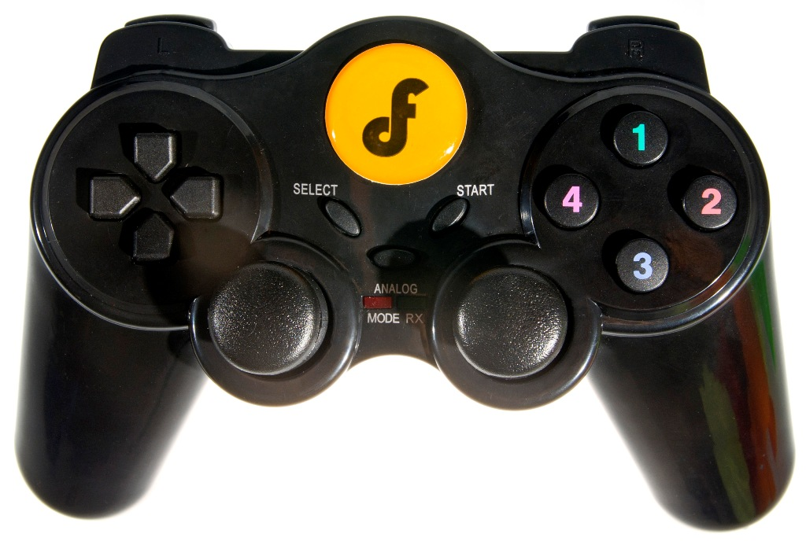

# Chaja Embedded Robot Platform - Gamepad

Is a lightweight library for "Wireless GamePad V2.0 for Arduino" from DF-Robot (https://www.dfrobot.com/product-858.html).
The motivation for writing this application and library was the dissatisfaction with provided code from DF-Robot.

The incoming and outcomming messages will be transmitted in a binary format,
which reduces the messages lengths to a minimum required data.

**Dependencies:**
_MegunoLink-Library_ is required, and can be found here: https://github.com/Megunolink/MLP.
I was too lazy to write my own Exponential Filter so I used MegunoLink-Library. Therefore many thanks to MegunoLink for providing such a well written library!
More Information about the filter can be found here: https://www.megunolink.com/documentation/arduino-libraries/exponential-filter/.

**Features:**

* Messages are received and transmitted in a binary format.
* Code in main (setup() & loop()) is reduced to the minimum.
* Easy to use Class (GamePadCtrl) to get/set Input-/Output-Controls.
* Auto calibration for Analog-Sticks at startup.
* Noise filtering for Analog-Sticks.
* Analog-Stick's can be mapped to a user defined lower and upper bound.
* Calculates a CRC8-Checksum.

**Naming-Convention:**

* **Input-Controls:** All kind of Inputs of the Gamepad (Buttons and Joysticks), which the user of the Gamepad presses.
* **Output-Controls:** All kind of Outputs of the Gamepad (Vibration and User-LED), which can be controlled from Outside.

**Files:**

* **GamePadMsg.h**: Contains data structures to store Input-/Output-Controls
* **GamePadPins.h**: Pin-Definitions of Gamepad.
* **GamePadCtrl.h/.cpp**: Class to update & transmit/receive Input-/Output-Controls
* **GamePad.ino**: Main program.

## Start-Up-Procedure

* Initializes the Pins
* Calibrates the Analog-Sticks
  * Measures the first i.e. 75 (ANALOG_SETTLE_MEASUREMENTS) values to give the filter time to settle down.
  * The filtered value is the determined Analog-Stick-Center-Value. -> ***Therefore don't touch the Analog-Sticks at Startup***
* Vibrates 500ms (START_UP_DELAY_MS) when startup is finished.

## Binary Format Definition

**_Attention_: The content of the structures is little-endian, therefore the receiver (and sender) of the Gamepad-Input-/Output-Controls should consider this!!!**

**GamePadMsgHeader**:

| Name   | Type    | Size (Bytes) | Value     | Description                                                 |
|--------|---------|--------------|-----------|-------------------------------------------------------------|
| magic  | uint8_t | 1            | 0x66      | Just an identifier to recognize this message as our own.    |
| cmd    | uint8_t | 1            | 0x01/0x10 | GPMH_CMD_INP (0x01)/GPMH_CMD_OUT(0x10); Command-Identifier; |
| length | uint8_t | 1            | 0x01-0xFF | Length of the Message (Payload)                             |
| crc8   | uint8_t | 1            | 0x01-0xFF | CRC8 Checksum                                               |

**GamePadInpCtr:**

| Name        | Type     | Size (Bytes) | Value         | Description                                         |
|-------------|----------|--------------|---------------|-----------------------------------------------------|
| leftStickX  | int8_t   | 1            |     0x00-0xFF | X-Value of Left-Analog-Stick                        |
| leftStickY  | int8_t   | 1            |     0x00-0xFF | Y-Value of Left-Analog-Stick                        |
| rightStickX | int8_t   | 1            |     0x00-0xFF | X-Value of Right-Analog-Stick                       |
| rightStickY | int8_t   | 1            |     0x00-0xFF | Y-Value of Right-Analog-Stick                       |
| buttons     | uint16_t | 2            | 0x0000-0xFFFF | Button-States; Every button is represented by a Bit |

*buttons-definition:*

| Name   | Offset | Button            |
|--------|--------|-------------------|
| select | 0x0    | Select            |
| start  | 0x1    | Start             |
| up     | 0x2    | Up-Arrow          |
| left   | 0x3    | Left-Arrow        |
| down   | 0x4    | Down-Arrow        |
| right  | 0x5    | Right-Arrow       |
| b1     | 0x6    | Button-1/Triangle |
| b2     | 0x7    | Button-2/Circle   |
| b3     | 0x8    | Button-3/Cross    |
| b4     | 0x9    | Button-4/Square   |
| l1     | 0xA    | L1                |
| l2     | 0xB    | L2                |
| l3     | 0xC    | L3                |
| r1     | 0xD    | R1                |
| r2     | 0xE    | R2                |
| r3     | 0xF    | R3                |

**GamePadOutCtr:**

| Name | Type    | Size (Bytes) | Value     | Description                                   |
|------|---------|--------------|-----------|-----------------------------------------------|
| cmds | uint8_t | 1            | 0x00-0x01 | Output-Control-States; Every output is a Bit  |

*cmd-definition:*

| Name      | Offset  | Output                               |
|-----------|---------|--------------------------------------|
| vibration | 0x0     | Turns vibration on/off               |
| _reserved | 0xE     | Not used! Reserved for future usage. |

> **_NOTE:_**  The LED is not really controllable from outside, because the electronic turns it on and off if serial-data is received.
